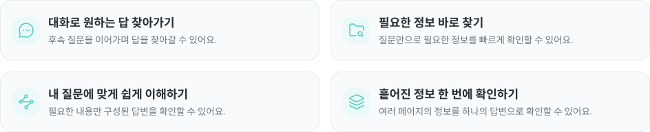
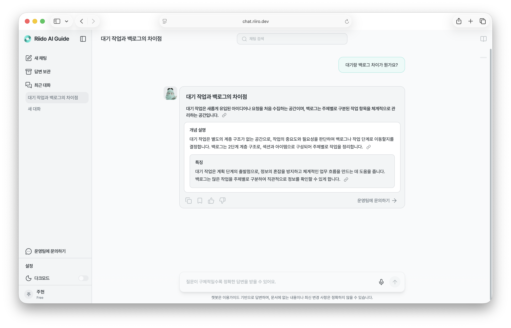
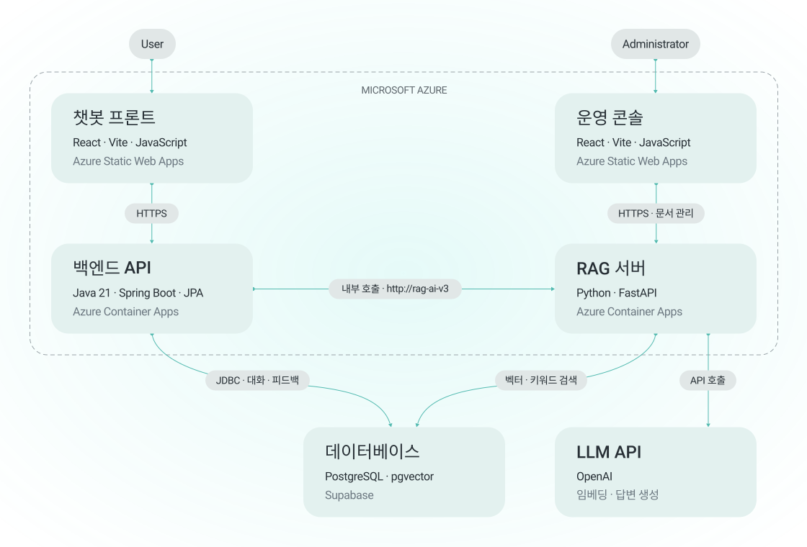
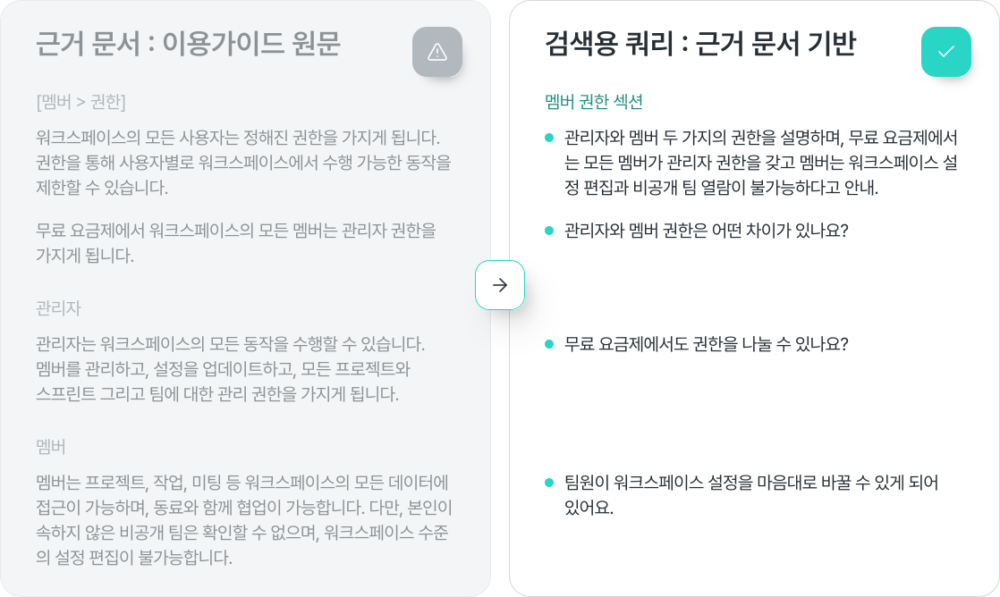
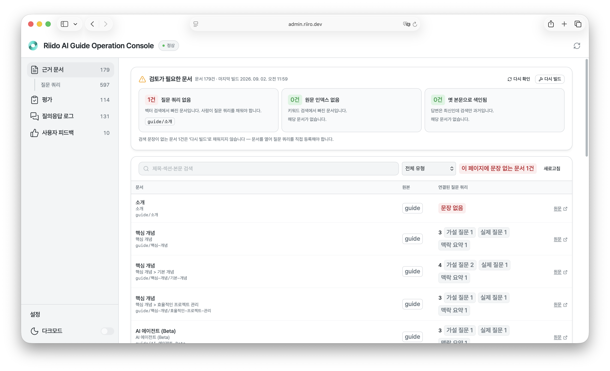

<!--
  Riido AI Guide — 조직 프로필 README
  위치: Riido-AI-Guide/.github  →  profile/README.md
  (이 경로에 두면 조직 첫 페이지에 그대로 렌더링됩니다)
-->

<div align="center">


<br /><br />


# 안녕하세요,<br />가이드 리로예요.

뤼이도를 이용하다 궁금한 점이 생기면 편하게 물어보세요.<br />
이용가이드를 바탕으로 빠르고 정확하게 답변해드릴게요!

<br />

[](https://chat.riiro.dev)
[](https://admin.riiro.dev/documents)

</div>

<br />

<div align="center">

</div>

<br />

---

## 프로젝트 소개

> 🤝 **미래내일 일경험 프로그램** 프로젝트<br />
> 팀의 협업과 프로젝트 관리를 한 곳에서 처리할 수 있는 B2B SaaS 워크스페이스 서비스 **[뤼이도(Riido)](https://www.riido.io)** 를 사용하는 과정에서 생기는 이용 방법 문의를 바로 해결할 수 있는 Riido AI Guide를 개발했습니다.

**Riido AI Guide**는 뤼이도 이용가이드 문서를 근거로 사용자의 질문에 답하는 **RAG 기반 AI 챗봇**과, 그 답변 품질을 관리하는 **운영 콘솔**로 이루어진 서비스입니다.

> **RAG (Retrieval-Augmented Generation, 검색 증강 생성)**<br />
> LLM이 알고 있는 지식만으로 답하지 않고, 먼저 사내 문서에서 질문과 관련된 부분을 **검색(Retrieval)** 한 뒤 그 문서를 근거로 **답변을 생성(Generation)** 하는 방식입니다.
> 예를 들어 "구글 캘린더 연동은 어떻게 하나요?"라는 질문이 들어오면, 모델이 기억에 의존해 지어내는 대신 이용가이드의 '캘린더 연동' 섹션을 찾아와 그 내용만으로 답을 만듭니다. 덕분에 **답변에 출처가 남고**, 가이드 문서가 바뀌면 답변도 같이 바뀝니다.

서비스는 두 개의 얼굴을 가집니다.

| | 대상 | 주소 | 하는 일 |
|---|---|---|---|
| **AI 챗봇** | 뤼이도 사용자 | [chat.riiro.dev](https://chat.riiro.dev) | 이용가이드 기반 질의응답, 후속 질문, 답변 보관 |
| **운영 콘솔** | 서비스 운영자 | [admin.riiro.dev](https://admin.riiro.dev/documents) | 근거 문서 관리, 답변 품질 평가, 질의응답 로그·피드백 확인 |

<p align="center">

</p>

<br />

---

## 아키텍처

<div align="center">

</div>

### 기술 스택

| 영역 | 사용 기술 |
|---|---|
| **Frontend** | React, Vite, JavaScript |
| **Backend** | Java 21, Gradle, Spring Boot, Spring Data JPA |
| **AI** | Python, FastAPI, OpenAI API |
| **Database** | PostgreSQL, pgvector, Supabase |
| **Infra** | Docker, GitHub Actions, GitHub Container Registry, Azure Container Apps (백엔드), Azure Static Web Apps (프론트) |

### 질문 하나가 처리되는 흐름

1. 사용자가 챗봇(`riido-chatbot-frontend`)에 질문을 입력합니다.
2. 질문은 `riido-chatbot-backend`로 전달됩니다. 여기서 세션·대화 이력·권한 같은 **서비스 레벨의 맥락**이 붙습니다.
3. 백엔드는 `riido-rag-search`를 호출합니다. 이 서비스가 AI 파트 전체를 담당합니다.
   - 키워드 검색과 벡터 검색을 함께 쓰는 **하이브리드 검색**으로 관련 문서 조각(chunk)을 찾습니다. ([검색 설계](#검색-설계--하이브리드-검색) 참고)
   - 검색된 문서를 컨텍스트로 넣어 **LLM에게 답변을 생성**시킵니다.
4. 생성된 답변과 근거 문서가 백엔드를 거쳐 **사용자에게 먼저 전송**됩니다. 사용자는 평가를 기다리지 않고 바로 답을 받습니다.
5. 응답이 나간 뒤, **평가 파이프라인이 백그라운드에서** 실행되어 답변을 **LLM-as-a-Judge**로 채점합니다. 평가 결과는 사용자에게는 노출되지 않고 **운영 콘솔(`riido-admin-frontend`)의 운영자에게만** 제공됩니다.
6. 운영자는 쌓인 질의응답 로그와 평가 결과를 보고 품질을 점검하고, 필요한 근거 문서를 보완합니다.

> **LLM-as-a-Judge**</br>
> 사람이 일일이 채점하는 대신, 다른 LLM에게 "이 답변이 주어진 근거 문서에 충실한가, 질문에 실제로 답하고 있는가"를 평가하게 하는 방법입니다.
> 예를 들어 근거 문서에 없는 내용이 답변에 섞여 들어가면(환각) 점수가 낮게 매겨지고, 그 케이스가 운영 콘솔의 **평가** 화면에 올라와 운영자가 바로 확인할 수 있습니다.

### 검색 설계 — 하이브리드 검색

<div align="center">

</div>

검색은 **키워드 검색**과 **벡터 검색(시맨틱 검색)** 을 함께 쓰는 하이브리드 방식입니다. 두 검색은 서로 다른 데이터를 대상으로 합니다.

| 검색 방식 | 검색 대상 | 구성 |
|---|---|---|
| **키워드 검색** | 근거 문서 | 뤼이도 공식 이용가이드를 청킹(chunking)한 문서 조각 |
| **벡터 검색** | 검색용 쿼리 | 근거 문서를 바탕으로, 실제 사용자의 질문과 비슷한 문장 구성으로 작성한 쿼리 테이블 |

> **왜 검색용 쿼리를 따로 만들었나요?**<br />
> 벡터 유사도는 두 문장의 구성이 비슷할수록 더 높은 점수를 받습니다.
> 이용가이드는 "관리자는 워크스페이스의 모든 동작을 수행할 수 있습니다."처럼 설명하는 문장으로 쓰여 있지만, 사용자는 "관리자랑 멤버는 뭐가 달라요?"처럼 질문하는 문장으로 묻습니다.
> 그래서 가이드 원문을 사용자 질문과 비슷한 형태로 다시 쓴 **검색용 쿼리**를 벡터 검색 대상으로 두어, 실제 질문과 더 잘 맞도록 했습니다.

<br />

---

## 레포지토리 구성

<table>
<tr>
<th width="28%">레포</th>
<th width="18%">기술 스택</th>
<th>역할</th>
</tr>

<tr>
<td valign="top">

**[riido-rag-search](https://github.com/Riido-AI-Guide/riido-rag-search)**

</td>
<td valign="top">

`FastAPI`<br />`Python`

</td>
<td valign="top">

**AI 코어.** 서비스의 지능이 전부 여기에 있습니다.

- 이용가이드 문서 색인 및 RAG 검색
- 검색 결과를 근거로 한 LLM 답변 생성
- LLM-as-a-Judge 기반 답변 품질 평가

</td>
</tr>

<tr>
<td valign="top">

**[riido-chatbot-backend](https://github.com/Riido-AI-Guide/riido-chatbot-backend)**

</td>
<td valign="top">

`Spring Boot`<br />`Java 21`

</td>
<td valign="top">

**서비스 백엔드.** 두 프론트엔드와 AI 서비스 사이를 잇습니다.

- 챗봇 / 운영 콘솔 API 제공
- 대화 세션·이력·보관 답변 관리
- `riido-rag-search` 호출 및 결과 중계
- 질의응답 로그, 사용자 피드백 적재

</td>
</tr>

<tr>
<td valign="top">

**[riido-chatbot-frontend](https://github.com/Riido-AI-Guide/riido-chatbot-frontend)**

</td>
<td valign="top">

`React`<br />`Vite`<br />`JavaScript`

</td>
<td valign="top">

**사용자가 마주하는 AI 챗봇.**

- 새 채팅, 후속 질문이 이어지는 대화형 인터페이스
- 답변 보관 / 최근 대화
- 답변 검색, 근거 출처 표시
- 다크모드

</td>
</tr>

<tr>
<td valign="top">

**[riido-admin-frontend](https://github.com/Riido-AI-Guide/riido-admin-frontend)**

</td>
<td valign="top">

`React`<br />`Vite`<br />`JavaScript`

</td>
<td valign="top">

**운영자의 운영 콘솔.**

- **근거 문서** — 검토가 필요한 문서 확인, 제목·섹션·본문 검색
- **평가** — 답변 품질 평가 결과 확인
- **질의응답 로그** — 실제 사용자 질문과 답변 이력
- **사용자 피드백** — 답변에 남긴 피드백 수집

</td>
</tr>
</table>

<br />

---

## 운영 콘솔 화면

<p align="center">

</p>

<br />

---

## 팀원 소개

<table align="center">
<tr>
<td align="center" width="220">
<a href="https://github.com/lisoooooo"></a><br />
<b>이수현</b><br />
<a href="https://github.com/lisoooooo">@lisoooooo</a><br /><br />
<sub>챗봇 UX 설계<br />UI 디자인 및 프로토타이핑</sub>
</td>
<td align="center" width="220">
<a href="https://github.com/3405000"></a><br />
<b>오재은</b><br />
<a href="https://github.com/3405000">@3405000</a><br /><br />
<sub>RAG 엔지니어링<br />웹 풀스택 개발</sub>
</td>
<td align="center" width="220">
<a href="https://github.com/yummsseo"></a><br />
<b>신윤서</b><br />
<a href="https://github.com/yummsseo">@yummsseo</a><br /><br />
<sub>RAG 엔지니어링<br />웹 풀스택 개발</sub>
</td>
</tr>
</table>

<br />

---

## 시작하기

각 레포의 README를 참고해주세요.

```
riido-rag-search        # AI · RAG 검색 서버 (FastAPI)
riido-chatbot-backend   # 서비스 백엔드 (Spring Boot)
riido-chatbot-frontend  # AI 챗봇 (React)
riido-admin-frontend    # 운영 콘솔 (React)
```

<!-- TODO: 로컬 실행 순서, 필요한 환경변수, 실행 포트를 확정되면 여기에 정리 -->

<br />

---

<div align="center">

**궁금한 점이 있으면 리로에게 먼저 물어봐 주세요.**

[💬 chat.riiro.dev](https://chat.riiro.dev) · [⚙️ admin.riiro.dev](https://admin.riiro.dev/documents)

<sub>챗봇 답변은 이용가이드를 기반으로 하며, 문서에 없는 내용이나 최신 변경 사항은 정확하지 않을 수 있습니다.</sub>

</div>
